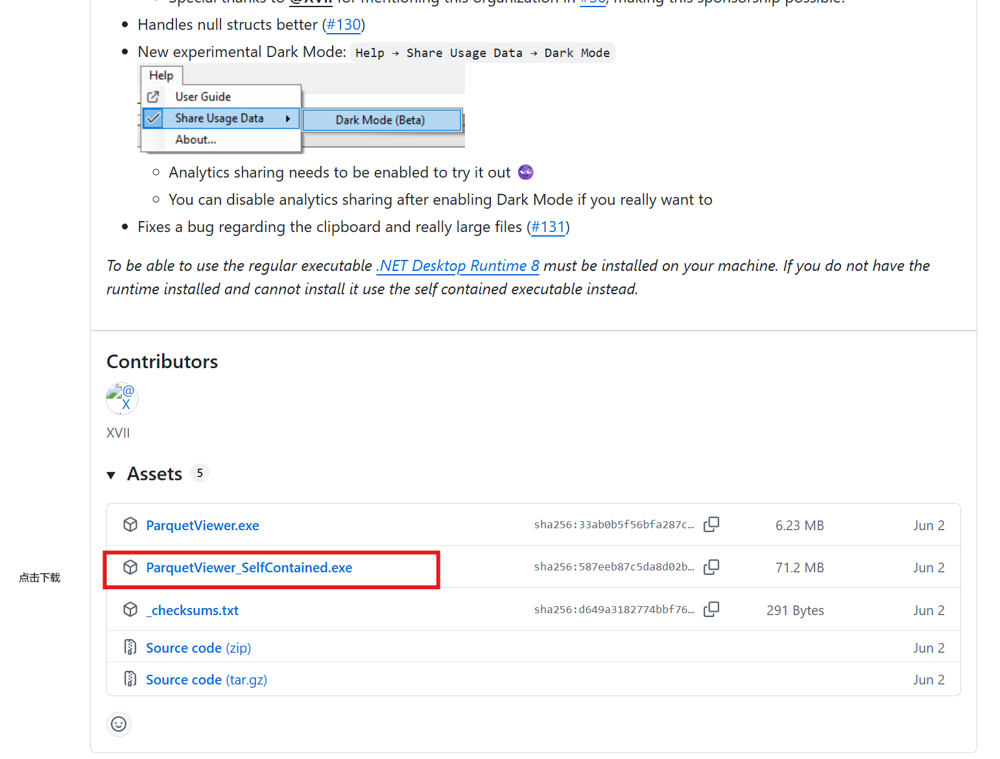
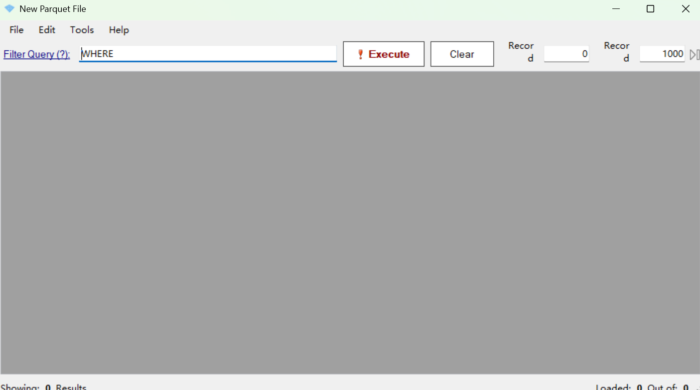
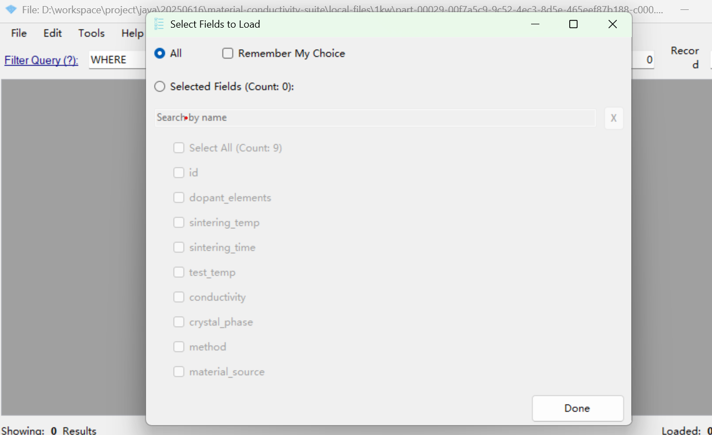
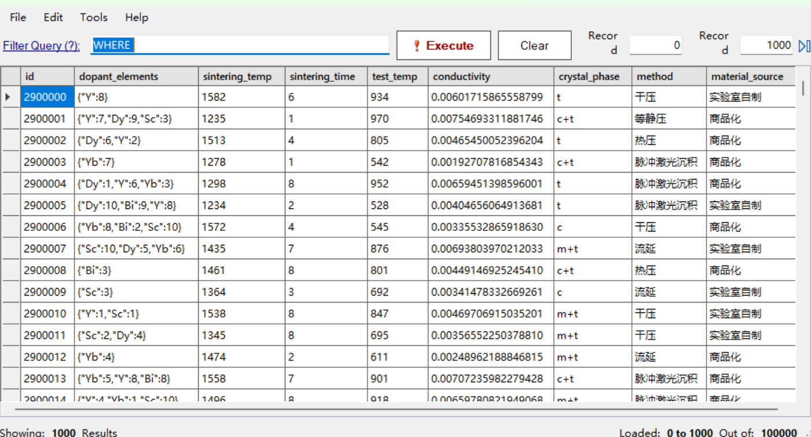

## 1. 从https://github.com/mukunku/ParquetViewer/releases下载ParquetViewer

## 2. 双击下载的执行文件出现以下界面

## 3. 把数据文件xxxx.parquet拖入到软件的界面中，然后点击Done；或者点击菜单栏中的File下的Open Folder选择所有parquet文件所在的文件夹，然后点击Done

## 4. 数据字段说明

| 字段名             | 类型     | 含义             | 说明                                                                | 示例值                | 取值范围 / 可选值                                               |
|--------------------|----------|------------------|---------------------------------------------------------------------|------------------------|------------------------------------------------------------------|
| `id`               | Long     | 样本编号         | 唯一标识符，从0开始自增                                             | 42                     | 0 ~ numRows - 1                                                  |
| `dopant_elements`  | String   | 掺杂元素及浓度   | JSON字符串，键为掺杂元素，值为摩尔浓度（1~10 mol%）               | {"Y":5,"Sc":3}         | 元素从 Y, Sc, Yb, Dy, Bi 中选1~3个，浓度范围为1~10              |
| `sintering_temp`   | Integer  | 烧结温度（℃）    | 烧结过程的温度                            | 1350                   | 1200 ~ 1600                                                      |
| `sintering_time`   | Integer  | 烧结时间（小时） | 高温烧结持续时间                            | 8                      | 1 ~ 10                                                           |
| `test_temp`        | Integer  | 测试温度（℃）    | 测量电导率时的温度                                                  | 800                    | 500 ~ 1000                                                       |
| `conductivity`     | String   | 电导率（S/cm）   | 高温下氧离子电导率                     | 0.001345678912345      | 约 1e-6 ~ 0.009，高精度小数字符串                                |
| `crystal_phase`    | String   | 晶体相结构       | 烧结后材料呈现的晶体相结构类型                                     | "c+t"                  | "c", "t", "c+t", "m+t"                                           |
| `method`           | String   | 成型方法         | 材料压制/沉积方式                                    | "热压"                 | "干压", "热压", "等静压", "流延", "脉冲激光沉积"               |
| `material_source`  | String   | 材料来源         | 原料来源，分为实验室合成或商业购入                                  | "实验室自制"           | "实验室自制", "商品化"                                          |

## 5. 数据增强策略

为提升数据的数量、丰富样本多样性并增强模型对复杂工艺条件的学习能力，设计了结构化的模拟数据增强策略。该策略以原始字段为基础，通过规则定义和物理启发模型，在可控范围内生成具有代表性的新样本。增强过程确保各字段的数值与实际实验条件相符，具有统计合理性和物理可解释性。

### 5.1 增强字段生成逻辑

下列字段为增强过程中的主要模拟变量，每条样本均通过独立采样构建，具体生成逻辑如下：

#### **1. `dopant_elements`（掺杂元素及其浓度）**

- **元素选择**：从 5 种候选元素（Y, Sc, Yb, Dy, Bi）中**随机选取 1–3 种元素**作为本样本的掺杂组合；
- **浓度生成**：每种元素赋予一个**1–10 mol%**之间的整数浓度；
- **组合结构**：所有掺杂信息整合为 JSON 字符串形式，如 `{"Y":6,"Sc":3}`，用于支持复合掺杂表达。

#### **2. `sintering_temp`（烧结温度）**

- 在 **1200–1600°C** 范围内**均匀采样整数值**；
- 用于模拟不同热处理条件下的微结构演化和离子传输行为。

#### **3. `sintering_time`（烧结时间）**

- 在 **1–10 小时**内**随机生成整数值**；
- 反映不同烧结持续时间对材料致密度与导电性能的影响。

#### **4. `test_temp`（测试温度）**

- 在 **500–1000°C** 区间内**均匀选取整数值**；
- 用于评估材料在高温工作环境下的氧离子迁移能力。

#### **5. `conductivity`（电导率）**

电导率是增强数据中最核心的目标变量，按以下方式估算：

- **基准值设定**：设定基础电导率起点为 $10^{-3}$ S/cm；
- **掺杂增强项**：掺杂浓度总和乘以 1e-4，表示正向提升作用；
- **温度增强项**：测试温度每升高 1°C，电导率增加 $1\times10^{-5}$；
- **随机扰动项**：引入高斯噪声（标准差为 1e-4）模拟测量误差；
- **下限截断**：电导率最终值不小于 $10^{-6}$，避免极端异常样本；
- **结果格式**：输出为高精度字符串，保留约 15 位有效数字（如 `"0.001345678912345"`）。

> 最终生成值可表示为：
>
> \[
> \text{conductivity} = \max\left(10^{-6}, 10^{-3} + \text{dopant\_sum} \times 10^{-4} + (\text{test\_temp} - 500) \times 10^{-5} + \epsilon \right)
> \]
> 其中 $\epsilon$ 表示高斯扰动项。

#### **6. `crystal_phase`（晶体相结构）**

- 从 `"c"`, `"t"`, `"c+t"`, `"m+t"` 中**等概率随机选取**一种；
- 反映烧结后可能形成的不同晶体结构组合。

#### **7. `method`（成型方式）**

- 从 `"干压"`, `"热压"`, `"等静压"`, `"流延"`, `"脉冲激光沉积"` 中**等概率选取**；
- 模拟样品的制备技术差异，影响微观结构。

#### **8. `material_source`（材料来源）**

- 在 `"实验室自制"` 与 `"商品化"` 之间随机选取；
- 表示样品原料的获取方式，影响批次稳定性与可追溯性。

---

### 5.2 样本生成流程简述

每一条模拟样本的生成遵循以下流程：

1. 随机确定掺杂元素组合及浓度；
2. 设定烧结温度、时间与测试温度；
3. 根据物理启发模型计算对应的电导率；
4. 随机选取晶相、成型方式与材料来源；
5. 封装为完整数据条目写入数据集。

---

### 5.3 增强数据的特征优势

| 特征         | 描述                                                                 |
|--------------|----------------------------------------------------------------------|
| **物理合理性**   | 所有值均在合理工程范围内，符合常见陶瓷导体的实验规律                  |
| **结构一致性**   | 与原始实验数据字段完全一致，可直接拼接训练                             |
| **多样性高**     | 多组合、多分布采样方式生成丰富样本，覆盖更多参数空间                   |
| **可重复生成**   | 利用固定随机种子，支持重复生成相同增强集                                |
| **应用广泛**     | 适用于回归建模、特征选择、模型泛化评估、拟合验证等多种机器学习场景     |

---

